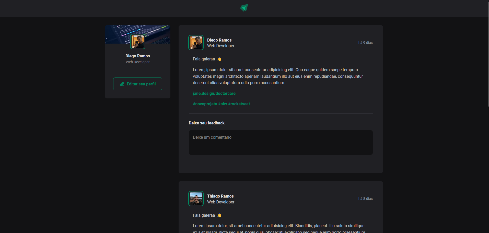

# Ignite Feed 📚

<!---Esses são exemplos. Veja https://shields.io para outras pessoas ou para personalizar este conjunto de escudos. Você pode querer incluir dependências, status do projeto e informações de licença aqui--->
<h1>
  Tecnologias 👨‍💻
  </br>
  </br>
  <div align="center">
    
    
    
  </div>
</h1>

<p align="center">
  
</p>

> Link da aplicação: <a href="https://ignite-feed-lyart.vercel.app/">Ignite feed</a>

## 🖖🏼 Objetivo

Aplicação criada no modulo de "Fundamentos do ReactJs" no curso ignite na trilha de reactJs

## 💻 Pré-requisitos

Antes de começar, verifique se você atendeu aos seguintes requisitos:

<!---Estes são apenas requisitos de exemplo. Adicionar, duplicar ou remover conforme necessário--->

- Ter instalado o nodeJs

## 🚀 Instalando Ignite Feed

Para instalar o Ignite Feed, siga estas etapas:

</br>

**Linux, macOS e Windows :**

**Clone o repositório**

```
  git clone https://github.com/DiegoRamos-b/ignite-feed.git
```

Depois execute os seguintes comando

**Npm**

```
  npm install
```

```
  npm start
```
